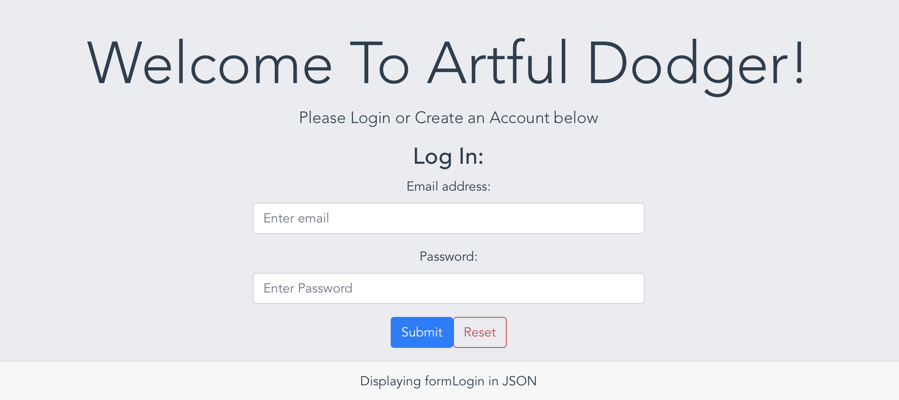

# Artful Dodger

My name is Team Vue. Welcome to my Artful Dodger node app.

## Description

You can log into an exclusive chatroom where nothing is saved or stored.

## Table of Contents

* [Languages](#languages)
* [Installation](#installation)
* [Usage](#usage)
* [Contributing](#contributing)
* [Tests](#tests)
* [License](#license)
* [Questions](#questions)
* [Comments](#comments)

## Language(s)

Language(s) used in this project:
HTML,CSS,JavaScript

## Installation

> Clone repo with `git@github.com:Calterat/artfuldodger`, navigate into the new directory and `npm install`. Then `npm run build&& npm start` will build out the Vue files and start the express server. Open up your browser and got to localhost:3001. All done!

## Usage

> Anonymous chatting with no reprecussions.

## Contributing

> Clone the repo, create a feature branch to add then request a pull!
 

## Tests

> N/A

## License

This project is covered under the license of [MIT License](https://GitHub.com/Calterat/artfuldodger/blob/main/LICENSE.txt)

## Questions

You can find my repository URL [Here](https://GitHub.com/Calterat)

         Here is the link to the site URL: https://guarded-caverns-91294.herokuapp.com
         

If you have additional questions, you may reach me at my E-mail Address: Calterat@gmail.com

## Comments

> No additional comments.

